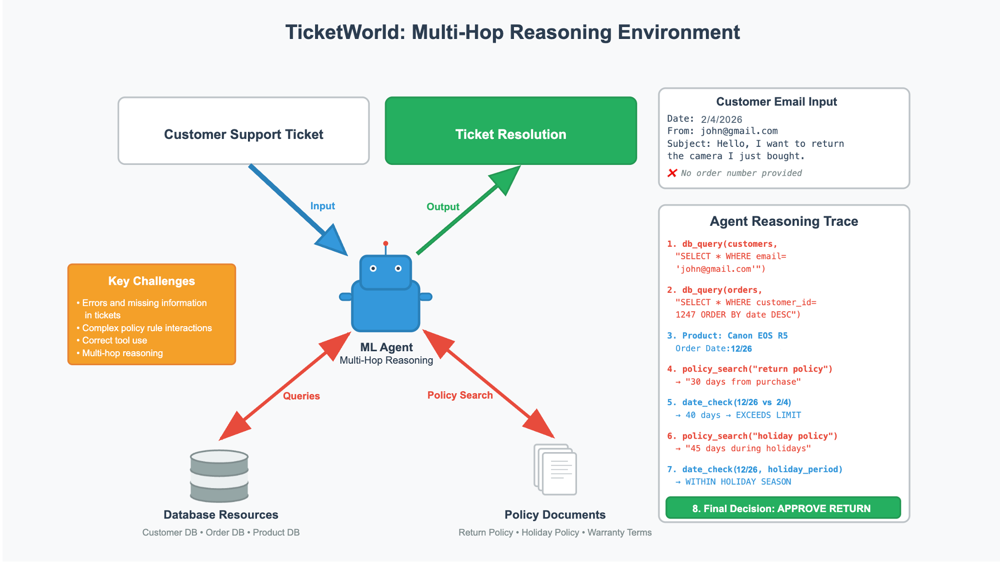

# TicketWorld: Synthetic Customer Service Dataset Generator

TicketWorld generates realistic customer service datasets and environments for training and evaluating LLM systems. Creates customer support scenarios with interconnected databases, policy documents, and resolution plans.



## 🎯 Project Goals

**TicketWorld** generates synthetic customer service data that challenges LLM systems with:

- **Multi-hop policy reasoning**: Tickets require understanding interactions between multiple company policies
- **Tool use and effecitve lookup**: For all tickets, access to customer information, product information, order information, and company policy document is required to create an accurate resolution. These assets are stored separately in a database and standalone .txt file, requiring effective multi-hop queries and search.
- **Realistic customer scenarios**: Edge cases, partial information, and complex situations
- **Policy compliance validation**: Resolutions must reference and apply specific policy clauses
- **Authentic data relationships**: Customers, orders, and products with realistic transaction histories

## 🏗️ How Tickets Are Generated

The system uses a **carefully orchestrated synthetic data pipeline** that respects asset dependencies and provides targeted information access:

1. **Policy Graph Creation**: Company policies are modeled as interconnected clauses with relationships (overrides, modifies, requires)
2. **Scenario Templates**: Pre-built templates define customer situations (returns, exchanges, warranty claims, etc.) with varying conditions that require combining and reasoning over multiple policy rules
3. **Asset Generation Pipeline**: 
   - Generate **customers** with realistic profiles and contact information
   - Generate **products** with pricing, categories, and specifications
   - Generate **orders** using both customers and products, creating authentic transaction relationships
4. **Email Generation**: Using scenario templates and specific customer/order context, LLM creates customer emails from the customer's perspective. Emails are **realistic** due to varying levels of information provided by the customer: missing order numbers, misspelled order numbers, emails sent from secondary email address, etc. requiring database lookups, best-guess inference, or followup clarification requests.
5. **Resolution Generation**: Using all previous assets plus metadata, LLM acts as customer service rep to create policy-compliant resolutions

**The Key Innovation**: This synthetic data pipeline addresses the core challenge of generating high-quality datasets that nevertheless remains difficult for LLMs to solve. During generation, we provide **targeted information access** (specific customer records, relevant policies) and **deterministic metadata** to ensure consistency and minimize hallucination. However, during evaluation, these scaffolds are removed - the LLM must accurately retrieve information from large databases and reason over numerous possibly irrelevant pieces of data.

This approach generates datasets with **minimal errors** and **maximum consistency** while creating genuinely challenging multi-hop reasoning scenarios that require effective tool use and lookup capabilities.

In addition, this setup allows for the generation of new, fresh batches of ticket data. This helps mitigate overfitting, data contaimnation, and staleness often seen on static train and test sets, similar to [FreshStack](https://fresh-stack.github.io/). 


## 🚀 Setup & Installation

### Prerequisites

- Python 3.11+
- [uv](https://docs.astral.sh/uv/) for dependency management
- Google Gemini API access

### Installation

```bash
# Clone the repository
cd ticketworld

# Install dependencies
uv sync

# Set up environment variables
cp .env.example .env  # Create this file
```

### Environment Configuration

Create a `.env` file in the project root:

```bash
# Required: Google Gemini API key
GEMINI_API_KEY=your-gemini-api-key-here
```

Get your API key from [Google AI Studio](https://aistudio.google.com/app/apikey).

## 📋 Usage

### Basic Usage

Generate a dataset with default settings:

```bash
# Run with test configuration (100 tickets, 50 customers, 35 products, 70 orders)
uv run python factory.py
```

### Custom Configuration

```bash
# Generate larger dataset
uv run python factory.py --tickets 500 --customers 200 --products 100 --orders 300

# Append to existing dataset
uv run python factory.py --mode append --tickets 100

# Custom output directory
uv run python factory.py --output-dir ./my_dataset --tickets 200

# Exclude debug metadata (for clean training data)
uv run python factory.py --no-debug --tickets 1000
```

### Complete Workflow

For a full dataset with all enhancements:

```bash
# 1. Generate core dataset
uv run python factory.py --tickets 500 --customers 200

# 2. Add policy dilution (makes policy document more realistic)
uv run python utils/policy_dilution_script.py

# 3. Convert to SQLite for easier querying
uv run python utils/convert_to_sqlite.py
```

## 🛠️ Utilities (`utils/` directory)

### Core Workflow Utils

| Script | Purpose | When to Run |
|--------|---------|-------------|
| `policy_dilution_script.py` | Adds irrelevant content to policy document to simulate real-world policy complexity | After factory.py |
| `convert_to_sqlite.py` | Converts JSON customer database to SQLite for easier querying and analysis | After factory.py |

### Development & Analysis Utils

| Script | Purpose | Use Case |
|--------|---------|----------|
| `audit_tickets.py` | Reviews generated tickets for policy compliance and errors | Quality assurance, debugging |
| `validate_templates.py` | Analyzes scenario templates and discovers policy interactions | Template development, validation |

### Running Utilities

```bash
# Add policy dilution
cd utils && python policy_dilution_script.py

# Convert to SQLite
cd utils && python convert_to_sqlite.py

# Audit ticket quality (optional)
cd utils && python audit_tickets.py

# Validate templates (development tool)
cd utils && python validate_templates.py
```

## 📁 Generated Assets

After running the factory, the `assets/` directory contains:

### Core Dataset Files

| File | Description | Size (typical) |
|------|-------------|----------------|
| `support_tickets.json` | Complete ticket dataset with customer emails and resolutions | ~350KB (100 tickets) |
| `customer_database.json` | Customer profiles, orders, and product catalog | ~80KB (50 customers) |
| `company_policy.txt` | Clean company policy document | ~3KB |

### Enhanced Files (after utils)

| File | Description | Generated By |
|------|-------------|--------------|
| `company_policy_full.txt` | Policy document with realistic dilution content | `policy_dilution_script.py` |
| `customer_database.db` | SQLite version of customer database | `convert_to_sqlite.py` |

### Analysis Files

| File | Description | Contents |
|------|-------------|----------|
| `policy_graph.json` | Policy interaction structure and metadata | Policy relationships, complexity analysis |
| `ticket_audit_results.json` | Quality analysis of generated tickets | Compliance scores, error detection |
| `ticket_audit_report.txt` | Human-readable audit summary | Policy violations, recommendations |

## 🎛️ Configuration Options

### Factory Parameters

```bash
--tickets N          # Number of tickets to generate (default: 100)
--customers N        # Number of customers (default: 50)  
--products N         # Number of products (default: 35)
--orders N           # Number of orders (default: 70)
--mode MODE          # "create" or "append" (default: create)
--output-dir DIR     # Output directory (default: ./assets)
--company-name NAME  # Company name for policies (default: TechNest)
--no-debug          # Exclude debug metadata for clean training data
```

### Dataset Composition

The generator creates realistic distributions:

- **Ticket Types**: Returns (25%), Shipping Issues (20%), Billing Disputes (20%), Warranty Claims (15%), etc.
- **Complexity Levels**: Simple (40%), Requires Lookup (35%), Edge Cases (20%), Escalation Required (5%)
- **Customer Tiers**: Standard (70%), Premium (20%), VIP (10%)
- **Information Completeness**: Complete (30%), Missing Details (40%), Wrong Info (30%)

## 🎯 Use Cases

### LLM Training & Evaluation

- **Policy Reasoning**: Test multi-hop policy application
- **Customer Service**: Train on realistic support scenarios  
- **Edge Case Handling**: Challenge models with incomplete information
- **Business Logic**: Validate understanding of complex rules

### Dataset Analysis

```python
import json

# Load tickets
with open('assets/support_tickets.json') as f:
    tickets = json.load(f)

# Analyze policy complexity
complex_tickets = [t for t in tickets if len(t['_policy_analysis']['applicable_policies']) > 2]
print(f"Multi-policy tickets: {len(complex_tickets)}")
```

### SQL Querying (after SQLite conversion)

```sql
-- Find high-value orders with issues
SELECT c.name, o.order_id, o.total_amount 
FROM customers c 
JOIN orders o ON c.customer_id = o.customer_id 
WHERE o.total_amount > 500;

-- Customer purchase patterns
SELECT customer_id, COUNT(*) as order_count, AVG(total_amount) as avg_order
FROM orders 
GROUP BY customer_id 
ORDER BY order_count DESC;
```

## 📊 Quality Features

- **Policy Compliance**: All resolutions reference specific policy clauses
- **Realistic Timing**: Email timestamps align with customer descriptions ("last week", "a few months ago")
- **Data Consistency**: Customer/order relationships are maintained across all tickets
- **Edge Cases**: Wrong emails, missing information, partial customer matches
- **Multi-hop Reasoning**: Complex scenarios requiring multiple policy interactions

## 🔧 Development

### Adding New Scenarios

1. Edit scenario templates in `factory.py` (`create_scenario_templates()`)
2. Run `utils/validate_templates.py` to discover policy interactions
3. Test with `utils/audit_tickets.py` for compliance

### Extending Policies

1. Add new policy clauses in `create_policy_graph()` 
2. Define relationships (overrides, modifies, requires)
3. Update scenario templates to reference new policies

## 📈 Performance

- **Generation Speed**: ~1-2 tickets/second (depends on LLM response time)
- **Memory Usage**: ~100MB for typical datasets
- **Output Size**: ~5MB for 1000 tickets with full metadata

---

*TicketWorld creates comprehensive testing environments for customer service AI systems, ensuring robust handling of real-world complexity and multi-policy reasoning scenarios.*
